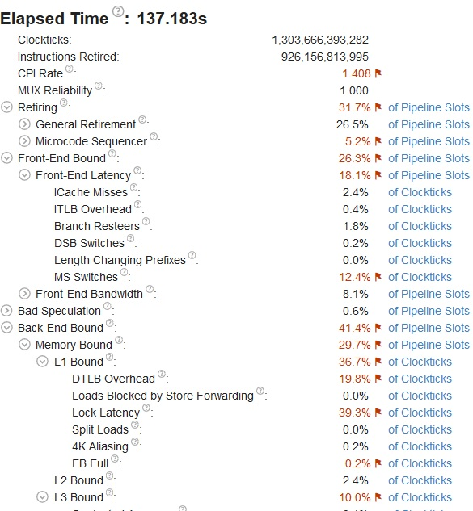
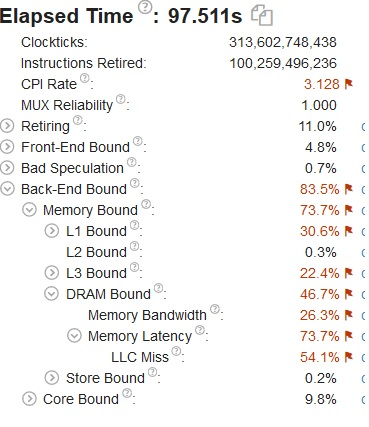
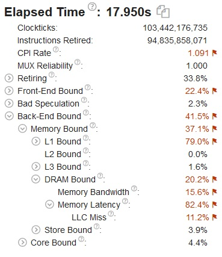
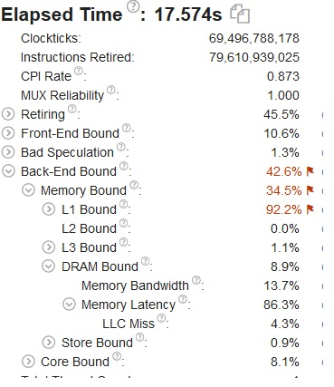
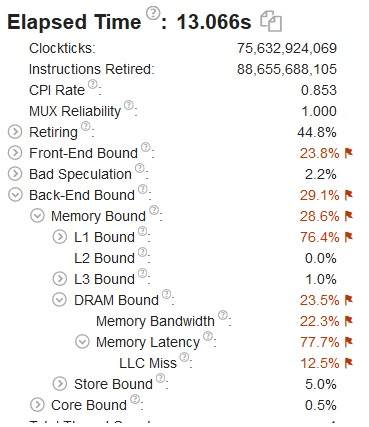
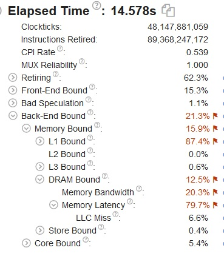
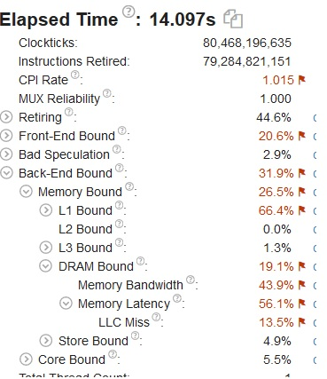
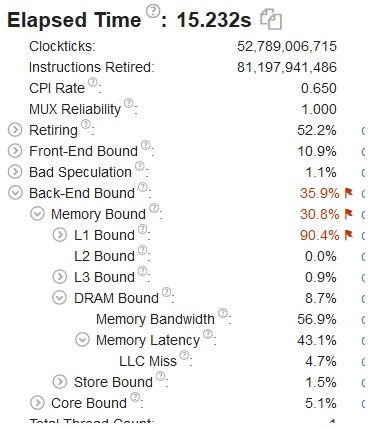
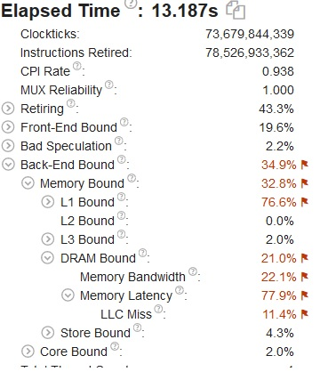
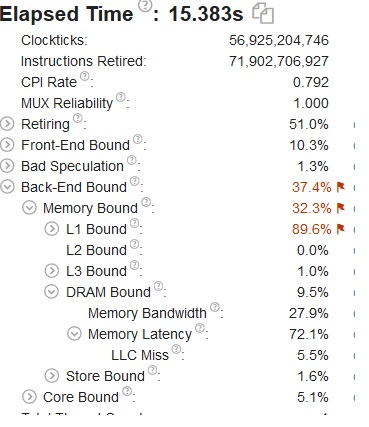

# Отчет

# сборка
```bash
git clone https://github.com/arechesk/optimization_course.git
cd optimization_course
icl -Wall -Qopenmp ./matMul.cpp -o L3_miss

```

# запуск
- ```./L3_miss 0``` - запуск без оптимизации
- ```./L3_miss 1``` - запуск с оптимизацией 

# Описание performance проблемы
L3-cache miss - промахи кэша 3 уровня.

# Описание решаемой программой задачи
Программа перемножает две целочисленных матрицы размером 2000 на 2000.

# Оптимизация
- Основная оптимизация для минимизации промахов кэша, транспонировал вторую матрицу.
- Распараллелил внешний цикл средствами OpenMP.

0.
  ```c++
   void multiplyMat0(int **a, int **b, int **c, int size) {
	for (int i = 0; i < size; i++)
	for (int j = 0; j < size; j++)
			for (int k = 0; k < size; k++)
				c[i][j] += a[i][k] * b[k][j];}
   ``` 
   
1.
  ```c++
  void multiplyMat1(int **a, int **b, int **c, int size) {
	b = T(b, size);
//#pragma omp parallel for
	for (int i = 0; i < size; i++)
		for (int j = 0; j < size; j++)
			#pragma ivdep
			for (int k = 0; k < size; k+=4) {
				c[i][j] = c[i][j] + a[i][k] * b[j][k];
				c[i][j] = c[i][j] + a[i][k+1] * b[j][k+1];
				c[i][j] = c[i][j] + a[i][k+2] * b[j][k+2];
				c[i][j] = c[i][j] + a[i][k+3] * b[j][k+3];
			}
}
   ``` 
2.
  ```c++
  void multiplyMat2(int **a, int **b, int **c, int size) {
//#pragma omp parallel for
	for (int i = 0; i < size; i++)
		for (int k = 0; k < size; k++)
		for (int j = 0; j < size; j++)
				c[i][j] += a[i][k] * b[k][j];
}
   ``` 
3.
  ```c++
   void multiplyMat3(int **a, int **b, int **c, int size) {
//#pragma omp parallel for
	for (int i = 0; i < size; i+=16)
		for (int k = 0; k < size; k++)
			{for (int j = 0; j < size; j++)
		{

			
				c[i][j] += a[i][k] * b[k][j];
				c[i+1][j] += a[i+1][k] * b[k][j];
				c[i+2][j] += a[i+2][k] * b[k][j];
				c[i+3][j] += a[i+3][k] * b[k][j];
				c[i+4][j] += a[i+4][k] * b[k][j];
				c[i+5][j] += a[i+5][k] * b[k][j];
				c[i+6][j] += a[i+6][k] * b[k][j];
				c[i+7][j] += a[i+7][k] * b[k][j];
				c[i+8][j] += a[i+8][k] * b[k][j];
				c[i+9][j] += a[i+9][k] * b[k][j];
				c[i+10][j] += a[i+10][k] * b[k][j];
				c[i+11][j] += a[i+11][k] * b[k][j];
				c[i+12][j] += a[i+12][k] * b[k][j];
				c[i+13][j] += a[i+13][k] * b[k][j];
				c[i+14][j] += a[i+14][k] * b[k][j];
				c[i+15][j] += a[i+15][k] * b[k][j];
				
			}
		}
	
}
   ``` 
 4.
  ```c++
  void multiplyMat4(int **a, int **b, int **c, int size) {
	
	
	b = T(b, size);
//#pragma omp parallel for
	for (int i = 0; i < size; i+=16)
		for (int j = 0; j < size; j++)
#pragma ivdep
			for (int k = 0; k < size; k++) {
				c[i][j] = c[i][j] + a[i][k] * b[j][k];
				c[i + 1][j] += a[i + 1][k] * b[j][k];
				c[i + 2][j] += a[i + 2][k] * b[j][k];
				c[i + 3][j] += a[i + 3][k] * b[j][k];
				c[i + 4][j] += a[i + 4][k] * b[j][k];
				c[i + 5][j] += a[i + 5][k] * b[j][k];
				c[i + 6][j] += a[i + 6][k] * b[j][k];
				c[i + 7][j] += a[i + 7][k] * b[j][k];
				c[i + 8][j] += a[i + 8][k] * b[j][k];
				c[i + 9][j] += a[i + 9][k] * b[j][k];
				c[i + 10][j] += a[i + 10][k] * b[j][k];
				c[i + 11][j] += a[i + 11][k] * b[j][k];
				c[i + 12][j] += a[i + 12][k] * b[j][k];
				c[i + 13][j] += a[i + 13][k] * b[j][k];
				c[i + 14][j] += a[i + 14][k] * b[j][k];
				c[i + 15][j] += a[i + 15][k] * b[j][k];
				
			}
}
   ``` 


# Результат
После оптимизации производительность выросла в 6,7 раз.

|#|**Intel compiler**|**MS Visual Studio**|
|--|--|--|
|0|| |
|1|| |
|2|| |
|3|| |
|4|| |

