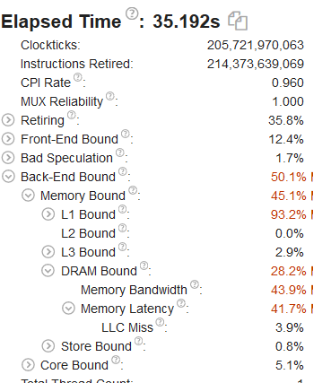

# Отчет

# сборка
```bash
git clone https://github.com/arechesk/optimization_course.git
cd optimization_course
icl -Wall -Qopenmp ./matMul.cpp -o L3_miss

```

# запуск
- ```./L3_miss 0``` - запуск без оптимизации
- ```./L3_miss 1``` - запуск с оптимизацией 

# Описание performance проблемы
Обращение к основной памяти стоит дорого, потому чтобы уменьшить время работы программы, используемые данные из основной памяти подгружаются в многоуровневый кэш. Таким образом, перед обращением к более долгой памяти просматривается содержимое более быстрой памяти последовательно на каждом уровне кэша и далее возможен один из двух вариантов развития событий:
- если данные обнаруживаются в кэш-памяти более высокого уровня, то есть произошло кэш-попадание (cache-hit), они считываются из нее и результат передается источнику запроса;
- если данные в кэш-памяти более высокого уровня отсутствуют, то есть произошел кэш-промах (cache-miss), то они ищутся в памяти следующего по иерархии уровня и так вплоть до основной памяти. При обнаружении искомых данных они передаются источнику запроса и одновременно копируются в кэш-память более высокого уровня.


# Описание решаемой программой задачи
Программа перемножает две целочисленных матрицы размером 4096 на 4096.

# В каком месте программы проблема возникает в вашей задаче
Проблема возникает из-за того, что обход второй матрицы происходит не в том порядке в котором она хранится в памяти.Матрица обходится по столбцам а подгружается в кэш построчнои по 64 байта.

# Как эту проблему починить
Можно реализовать блочный алгоритм перемножения матриц, при использование блочного алгоритма локальность доступа к памяти возрастает, что и приводит уменьшению количества кэш-промахов. 


# Результат
Испытания проводились на компьютере с процессором Intel i5 ivyBridge, L1-128Kb, L2-512Kb, L3-3Mb

|#|**Intel compiler**|**MS Visual Studio**|
|--|--|--|
|0.(без оптимизации)|| |
|1.(с оптимизацией)|| |

